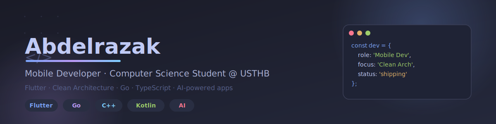

  

# Hi, I'm Abdelrazak 👋

### Mobile Developer · Computer Science Student @ USTHB

Building modern, scalable, and user-friendly mobile applications — with clean architecture and an obsession for polish.

 

## About Me

I'm a CS student at **USTHB** who enjoys turning ideas into real, working products — not just prototypes. Most of my time goes into Flutter apps built with strict Clean Architecture, but I also like going lower-level: systems programming, compilers, and the occasional CTF challenge.

- 📱 Shipping production-grade Flutter apps (Clean Architecture, BLoC/Riverpod)
- 🏗 Designing offline-first, maintainable app architectures
- 🌐 Building backend tooling in Go and Node.js
- 🤖 Integrating AI into mobile experiences
- 🔐 Exploring web security through CTF challenges

 

## What I'm Building

| Project | Description |
|---|---|
| **MultiAI Mobile** | Flutter app with Clean Architecture, BLoC, and a FastAPI backend — focused on smart image caching and API reliability |
| **Rynex** | Offline-first infinite canvas drawing app, inspired by Excalidraw, built for smooth cross-platform gestures |
| **motarjim** | Open-source TypeScript compiler monorepo that transforms HTML/CSS into Flutter, Jetpack Compose, and SwiftUI |
| **Mutqin** | Fully offline Quran memorization app with RTL-first design, Riverpod + Isar |

 

## Tech Stack

**Mobile**

**Frontend**

**Backend & Systems**

 

## GitHub Stats

 

## Currently Learning

`System Design` · `Distributed Systems` · `Advanced Flutter` · `DevOps` · `AI Integration`

 

*"First solve the problem. Then write the code."*

⭐ **Thanks for stopping by!**

